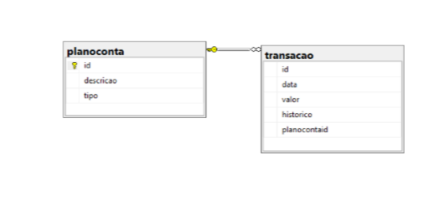
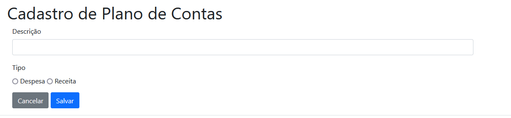
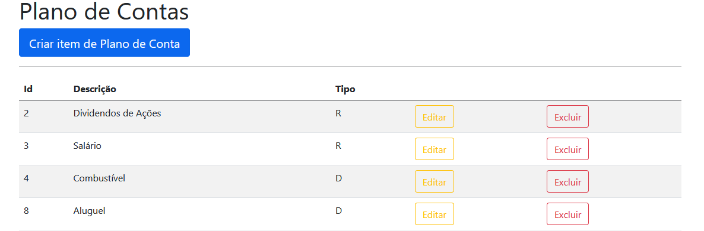
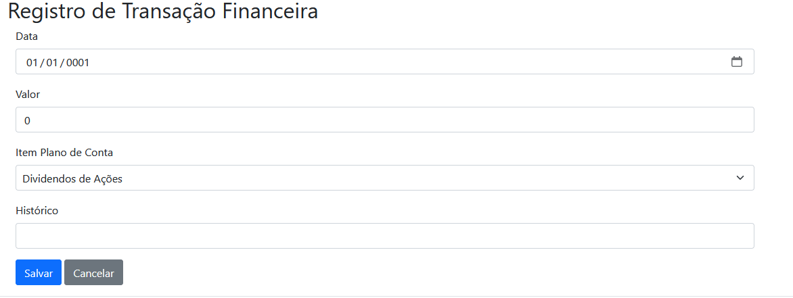
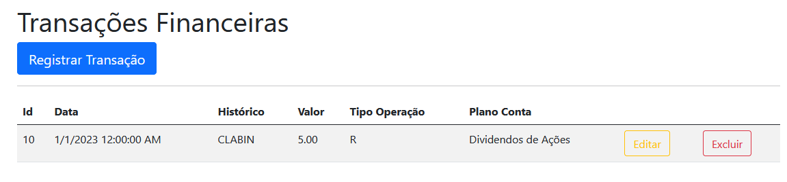

# myfinance-web-netcore
The application was designed with the purpose of facilitating financial control.

# DER - Diagrama de Entidade e Relacionamento

# Build the application 
``dotnet build``

# Run the application using Hot reload 
``dotnet watch run``

# Account overview
It is allowed through a functional requirement for the user to register a chart of accounts, as well as to view the existing charts of accounts. Information such as id, description, and type, which can be Expense or Revenue, can be viewed. The user also has the ability to edit a chart of account or remove it through the corresponding buttons.

# Transaction overview
It is allowed through a functional requirement for the user to register a transaction, as well as to view existing transactions. Information such as id, date, description, amount, type of operation which can be Expense or Revenue, and the Chart of Account to which it is linked can be viewed. The user also has the ability to edit a financial transaction or remove it through the corresponding buttons.

# Payment Method overview
It is allowed through an extra functional requirement for the user to indicate the payment type when the transaction is an "Expense". The application must allow the selection of the following types: Cash, Debit, Pix, Credit and Payment Slip.

~~~sql
1- Create new table in Database:

 create table metodopagamento(
    id int identity(1,1) not null,
    tipo varchar(50) not null,
  );

2- Populate table with types: Cash, Debit, Pix, Credit and Payment Slip.

 insert into metodopagamento
    (tipo)
    values
      ('Dinheiro'),
      ('Crédito'),
      ('Débito'),
      ('Pix'),
      ('Boleto'),

3- Create a FK into new table pontind to "metodoPagamento(Id)"

  ALTER TABLE transacao
  ADD metodopagamentoid INT
  REFERENCES metodopagamento(id);

